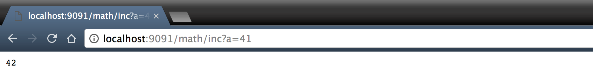
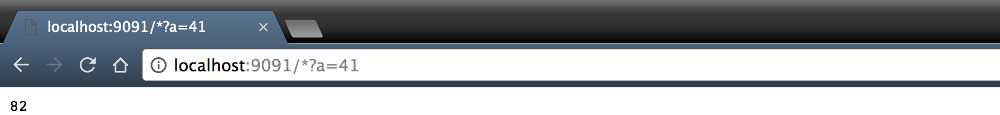

LispWeb
============


LispWeb is a functional multi-tiers programming language.

It becomes very easy to write web application in LispWeb because there
is no other language you need to use. You write the whole application
in LispWeb (server, client and database access)

## ⚡️ Quick start

To try it quickly, you can run a *read-eval-print-loop* (`repl`) into a docker container.

First, build the `repl` image

```bash
make build-repl-image
```

Then, run it

```bash
make run-repl-image
```

## A REST API in one line

```scheme
(let (/math/inc (lambda (a) (+ a 1))) (listen 9091))
```

You can

LispWeb can create servers with only two pieces.

### Port

In every languages, a server listen to a port for client.

In LispWeb, you can listen to a port with

```
(listen 9091)
```

### Service

The first line of HTTP client query is

```
<method> <url> <version>
```

The URL can contains query parameters.

In LispWeb

-  the name of the URL is the name of a function
-  a query parameter is a parameter of the function

#### Incrementing service

Let's declare a very simple service that increments an integer:

```scheme
(let (/math/inc (lambda (a) (+ a 1))) (listen 9091))
```

There is no need for a *special* treatment for functions and services.
A service is a function.

Syntactically speaking, `/` is valid in Scheme which is the richest languages for identificators.

Then you could name functions like `/api/v1/users`. 

Or with the more exotic `#-@{]*&%$!`.

Unfortunatelly you can't name a function like `;-)`. What a shame.

Copy/past in your browser

```
http://localhost:9091/math/inc?a=41
```


It will always answer 42 ;)

#### Doubling service

You could define the *doubling* service

```scheme
(let (/* (lambda (a) (* a 2))) (listen 9091))
```

Copy/past in your browser

```
http://localhost:9091/*?a=41
```


## Functional

The high expressiveness of functional programming languages is mainly due to functions that are [first-class citizen](https://en.wikipedia.org/wiki/First-class_citizen)

In functional languages you can sum integers without managing an index or using a for-each loop.

```ocaml
List.fold_left (fun sum x -> sum + x) 0 [1;2;3] (*OCaml*)
```

You express everything in a declarative manner, saying exactly what you need.

Copy/paste

```shell
echo "print_int(List.fold_left (fun sum x -> sum + x) 0 [1;2;3])" | ocaml -stdin
```

It will display `6`

## Parenthesis 

Most people are frigthened by parenthesis while it is a big advantage. 

It leaves no space for ambiguity.

Do you know that in C, arguments of function are evaluated in reverse order?

If you try to compile and execute

```c
#include <stdio.h> /* C */
char c = 'a';
int f(){c = 'f';return 6;}
int g(){c = 'g';return 7;}
void h(int x, int y){}
int main() {h(f(),g());printf("%c\n",c);return 0;}
```

It will display `f` with gcc because execute order is *right-to-left*.
It will display `g` with clang.

Copy/paste 

```shell
printf "#include <stdio.h>\nchar c='a';int f(){c='f';return 6;}int g(){c='g';return 7;}void h(int x,int y){}int main(){h(f(),g());printf(\"%%c\",c);return 0;}\n" | gcc -x c - & ./a.out
```

## Demo
You can test a fully working live demo at https://antun.me/node-chat/
- Type `/help` to get a list of the available chat commands

---

## Features
- Material Design
- Emoji support
- User @mentioning
- Private messaging
- Message deleting (for admins)
- Ability to kick/ban users (for admins)
- See other user's IPs (for admins)
- Other awesome features yet to be implemented

.


.


####There are 3 admin levels:
- **Helper:** Can delete chat messages
- **Moderator:** The above plus the ability to kick and ban users
- **Administrator:** All the above plus send global alerts and promote/demote users

---

## Setup
Clone this repo to your desktop and run `npm install` to install all the dependencies.

You might want to look into `config.json` to make change the port you want to use and set up a SSL certificate.

---

## Usage
After you clone this repo to your desktop, go to its root directory and run `npm install` to install its dependencies.

Once the dependencies are installed, you can run  `npm start` to start the application. You will then be able to access it at localhost:3000

To give yourself administrator permissions on the chat, you will have to type `/role [your-name]` in the app console.

---

## License
>You can check out the full license [here](https://github.com/IgorAntun/node-chat/blob/master/LICENSE)

This project is licensed under the terms of the **LGPL v3** license